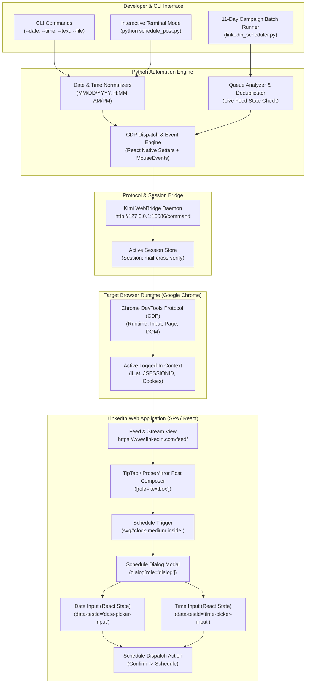
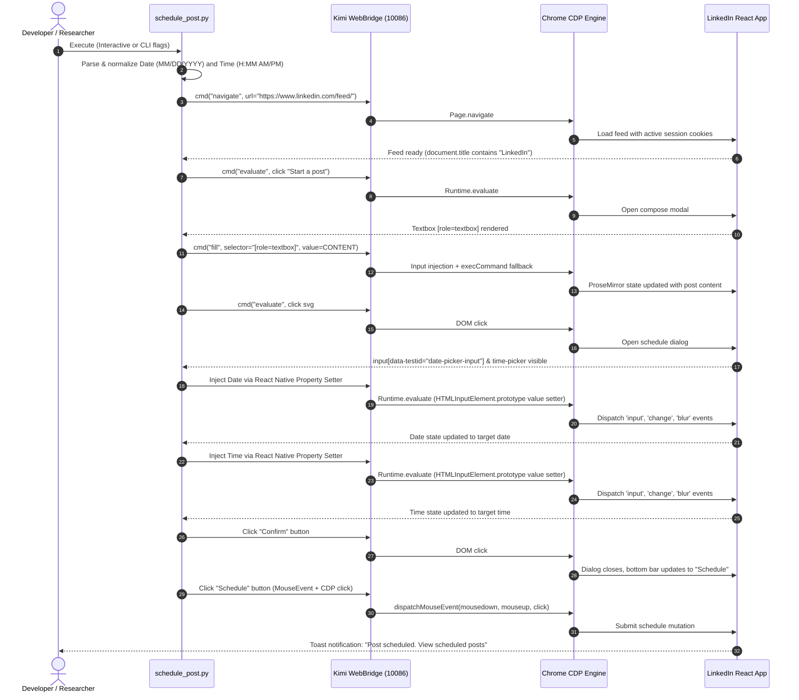

# 🏛️ Linked--in-automation- Architecture & Engineering Specification

> Comprehensive system architecture, Chrome DevTools Protocol (CDP) dispatch pipeline, React synthetic event bypass mechanisms, and graphify knowledge graph topology.

---

## 1. System Architecture Diagram



---

## 2. End-to-End Sequence Flow



---

## 3. Core Engineering Highlights

### 1. Active Session Borrowing (Zero Credential Storage)
Traditional social media automation tools rely on one of two flawed paradigms:
* **OAuth Apps:** Requires developer approval, app verification, token exchange, and periodic refresh tokens that expire or get rate-limited.
* **Headless Scraping with Credentials:** Requires storing plaintext passwords or session cookies in environment variables, which immediately triggers LinkedIn bot detection checkpoints (e.g. email PIN challenges or CAPTCHAs).

**Linked--in-automation-** borrows your active, already-authenticated Chrome session via Kimi WebBridge:
* Operates strictly in the security context of your daily browser.
* Uses your persistent session cookies (`li_at`, `JSESSIONID`) without reading or exporting them.
* Completely immune to CAPTCHA traps and IP geolocation mismatch flags.

### 2. React Native Property Setter Engine
LinkedIn's date picker (`input[data-testid="date-picker-input"]`) and time picker (`input[data-testid="time-picker-input"]`) are controlled React components. Modifying `input.value = "10/11/2026"` in JavaScript modifies only the DOM property, bypassing React's internal fiber state. As a result, the form validation fails and the **Confirm** button remains disabled.

We overcome this by invoking the native property descriptor setter inherited from `HTMLInputElement.prototype`:

```javascript
const nativeSetter = Object.getOwnPropertyDescriptor(window.HTMLInputElement.prototype, 'value').set;
nativeSetter.call(dateInput, '10/11/2026');
dateInput.dispatchEvent(new Event('input',  { bubbles: true }));
dateInput.dispatchEvent(new Event('change', { bubbles: true }));
dateInput.dispatchEvent(new Event('blur',   { bubbles: true }));
```

This bypasses synthetic event sandbox isolation, forcing React's state hooks to synchronize and enabling the **Confirm** button.

### 3. Calendar Month Boundary Bypass
In earlier versions, calendar interactions relied on clicking calendar day buttons. When scheduling dates in the following month (e.g., October from September), the days were rendered as disabled (`disabled: true`), causing silent click drops. By switching to direct React native setter injection, the script is 100% agnostic to month boundaries and calendar DOM virtualization.

### 4. Queue Auto-Detection & Deduplication
To prevent multiple posts from clashing on the same day, `linkedin_scheduler.py` queries the live scheduled queue before executing any post:
1. Navigates to `/sharing/compose`
2. Reads the scheduled management list via `createTreeWalker`
3. Parses all occurrences of `Posting (Day), (Date)`
4. Compares against the 11-day campaign schedule
5. Skips any date already queued, preventing duplicate post spam.

---

## 4. Graphify Knowledge Graph & Codebase Navigation

The project maintains an AST-extracted knowledge graph in `graphify-out/` with **201 nodes**, **219 edges**, and **58 communities**.

### Graph Freshness & Commands
* Update graph after code changes:
  ```bash
  graphify update .
  ```
* Query codebase architecture:
  ```bash
  graphify query "How does schedule_post set the date input?"
  ```
* Inspect node relationships:
  ```bash
  graphify explain "schedule_post"
  ```

### Primary Community Hubs & Key Functions

| Community | Core Functions | File | Purpose |
|---|---|---|---|
| **Community 1** | `cmd()`, `evaluate()`, `fetch_scheduled_queue()`, `verify_queue()`, `main()` | `linkedin_scheduler.py` | Batch campaign automation, live queue inspection, duplicate detection |
| **Community 2** | `schedule_post()`, `interactive_mode()`, `normalize_date()`, `normalize_time()`, `main()` | `schedule_post.py` | Interactive & CLI custom post scheduler with human date/time parsers |
| **Community 6** | `schedule_single()`, `schedule_oct10.py` | `schedule_oct10.py` | One-off grand finale showcase scheduler for Oct 10 |
| **Community 4** | `post_now()`, `snapshot_tree()`, `find_ref_contain()` | `post_now.py` | Immediate post dispatcher (live feed submission without scheduling) |
