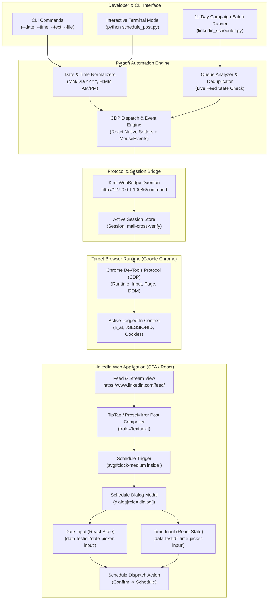
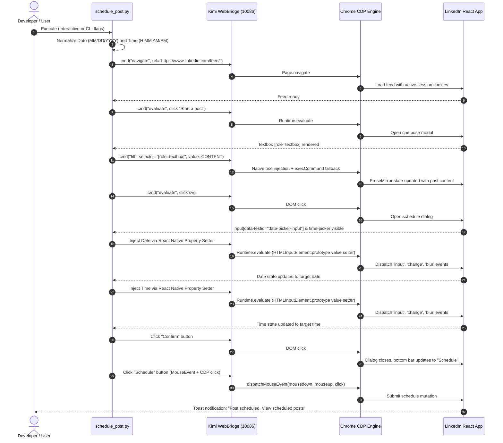

# 🤖 LinkedIn Smart Scheduler — Auto-Post Automation via Chrome DevTools Protocol

[](https://python.org)
[](LICENSE)
[](https://kimi.ai)
[](ARCHITECTURE.md)
[](graphify-out/GRAPH_REPORT.md)

> **Autonomously schedules LinkedIn posts on any custom future date and time using Chrome DevTools Protocol (CDP) & Kimi WebBridge — zero passwords, zero OAuth tokens, zero Selenium.**

---

## 📑 Table of Contents

- [System Architecture Diagram](#-system-architecture-diagram)
- [End-to-End Sequence Flow](#-end-to-end-sequence-flow)
- [Core Engineering Highlights](#-core-engineering-highlights)
- [Quickstart & Usage Guides](#-quickstart--usage-guides)
  - [1. Prerequisites](#1-prerequisites)
  - [2. Interactive Mode (Recommended)](#2-interactive-mode-recommended)
  - [3. CLI Command-Line Mode](#3-cli-command-line-mode)
  - [4. Automated 11-Day Campaign Runner](#4-automated-11-day-campaign-runner)
  - [5. One-Off Post Scripts](#5-one-off-post-scripts)
- [Graphify Knowledge Graph & Codebase Navigation](#-graphify-knowledge-graph--codebase-navigation)
- [Campaign Schedule (Sep 28 – Oct 10, 2026)](#-campaign-schedule-sep-28--oct-10-2026)
- [Repository File Map](#-repository-file-map)
- [Author & License](#-author--license)

---

## 🏛️ System Architecture Diagram



---

## 🔄 End-to-End Sequence Flow



---

## ⚡ Core Engineering Highlights

### 1. Active Session Borrowing (Zero Credential Storage)
Traditional automation relies on OAuth apps (which get revoked or rate-limited) or plaintext credential files (which trip bot detection). **Linked--in-automation-** borrows your active, authenticated Chrome session via Kimi WebBridge:
- Zero stored passwords or API keys.
- Completely immune to CAPTCHAs, 2FA prompts, and IP location mismatch alerts.
- Uses your existing logged-in session cookies (`li_at`, `JSESSIONID`) directly in browser context.

### 2. React Native Property Setter Engine
LinkedIn's date picker (`input[data-testid="date-picker-input"]`) and time picker (`input[data-testid="time-picker-input"]`) are controlled React components. Assigning `.value` directly fails because React overrides the property descriptor, leaving the **Confirm** button disabled.

We bypass the synthetic event sandbox by invoking the prototype descriptor directly:
```javascript
const nativeSetter = Object.getOwnPropertyDescriptor(window.HTMLInputElement.prototype, 'value').set;
nativeSetter.call(dateInput, '10/11/2026');
dateInput.dispatchEvent(new Event('input',  { bubbles: true }));
dateInput.dispatchEvent(new Event('change', { bubbles: true }));
dateInput.dispatchEvent(new Event('blur',   { bubbles: true }));
```

### 3. Month Boundary Calendar Bypass
Calendar grid clicks in web scrapers frequently fail when crossing month boundaries (e.g. October dates showing as `disabled: true` in September view). By driving the input directly via React native setters, the scheduling flow is completely decoupled from calendar grid rendering.

### 4. Queue Auto-Detection & Deduplication
Before executing batch schedules, `linkedin_scheduler.py` reads live scheduled posts from `/sharing/compose`. It parses every `Posting <Day>, <Date>` line and automatically skips any date already queued, preventing duplicate post spam.

---

## 🚀 Quickstart & Usage Guides

### 1. Prerequisites
- **Kimi WebBridge** daemon running on `http://127.0.0.1:10086` (Session: `mail-cross-verify`)
- Google Chrome open and **logged into LinkedIn**
- Python 3.8+ (stdlib only — zero pip dependencies)

### 2. Interactive Mode (Recommended)
Just run the script and answer the terminal prompts:
```bash
python schedule_post.py
```
**Interactive Prompt Flow:**
```text
📅 Enter target date (e.g. 10/10/2026 or Oct 10, 2026): 10/15/2026
⏰ Enter target time (e.g. 6:00 PM, 18:00) [Default: 12:00 PM]: 6:00 PM

📝 Choose how to provide post content:
   [1] Type / paste text directly here
   [2] Load text from a file (e.g. post.txt)
Select option (1 or 2) [Default: 1]: 1

Enter / paste your post content below.
(Type END on a new line or press Ctrl+Z to finish):
```

### 3. CLI Command-Line Mode
Execute post scheduling in a single automated command:

**Pass text directly:**
```bash
python schedule_post.py --date "10/15/2026" --time "6:00 PM" --text "Shipping something new today! 🚀"
```

**Load content from a file:**
```bash
python schedule_post.py --date "10/15/2026" --time "6:00 PM" --file "my_post.txt"
```

**Flexible Date & Time Formats Supported:**
- Dates: `10/15/2026`, `2026-10-15`, `Oct 15, 2026`, `15 Oct 2026`
- Times: `6:00 PM`, `06:00 PM`, `6pm`, `18:00`, `9:30 AM`

### 4. Automated 11-Day Campaign Runner
Run the complete 11-day open-source project showcase with automatic duplicate skipping:
```bash
python linkedin_scheduler.py
```

### 5. One-Off Post Scripts
- Immediate live post (no scheduling):
  ```bash
  python post_now.py
  ```
- Dedicated Oct 10 Finale post:
  ```bash
  python schedule_oct10.py
  ```

---

## 🧠 Graphify Knowledge Graph & Codebase Navigation

This repository is indexed with a structural knowledge graph generated via **Graphify** (`graphify-out/`).

### Graph Summary
- **Nodes**: 201 | **Edges**: 219 | **Communities**: 58
- **Extraction**: 100% AST Extracted (zero hallucinations, zero token cost)

### Codebase Navigation Commands
```bash
# Query the graph
graphify query "How does schedule_post set the date input?"

# Trace execution path between components
graphify path "interactive_mode" "schedule_post"

# Deep-dive explain a node
graphify explain "schedule_post"

# Update graph after modifying code files
graphify update .
```

### God Nodes & Community Hubs

| Community | Core Functions | File | Responsibility |
|---|---|---|---|
| **Community 2** | `schedule_post()`, `interactive_mode()`, `normalize_date()`, `normalize_time()` | `schedule_post.py` | Primary CLI & interactive custom scheduler |
| **Community 1** | `fetch_scheduled_queue()`, `verify_queue()`, `schedule_post()`, `main()` | `linkedin_scheduler.py` | 11-day campaign queue inspection & batch automation |
| **Community 6** | `schedule_single()`, `cmd()`, `evaluate()` | `schedule_oct10.py` | Dedicated standalone script for Saturday Oct 10 finale |
| **Community 4** | `post_now()`, `snapshot_tree()`, `find_ref_contain()` | `post_now.py` | Direct immediate post dispatcher via accessibility tree |

---

## 📅 Campaign Schedule (Sep 28 – Oct 10, 2026)

| Day | Date | Time | Repo / Showcase Topic |
|-----|------|------|------------------------|
| 1 | Sep 28 | 12:00 PM | [AUTO-MATIC-MAIL-AGENT-](https://github.com/roshan-pixel/AUTO-MATIC-MAIL-AGENT-) |
| 2 | Sep 29 | 12:00 PM | [WinClaw](https://github.com/roshan-pixel/winclaw) |
| 3 | Sep 30 | 12:00 PM | [Hermes WhatsApp AI Agent on GCP VM](https://github.com/roshan-pixel/-Hermes-WhatsApp-AI-Agent-on-Google-Cloud-VM) |
| 4 | Oct 1  | 12:00 PM | [-ledger_web](https://github.com/roshan-pixel/-ledger_web) |
| 5 | Oct 2  | 12:00 PM | [WhatsApp-Web-Session-to-Google-Sheets](https://github.com/roshan-pixel/WhatsApp-Web-Session-to-Google-Sheets-Automation-Bot) |
| 6 | Oct 3  | 12:00 PM | [Asclepius-Portal-Synchronizer](https://github.com/roshan-pixel/Asclepius-Wellness-Portal-to-Google-Sheets-Synchronizer-MLM-Ledger) |
| 7 | Oct 4  | 12:00 PM | [TODOBAR](https://github.com/roshan-pixel/TODOBAR----DSKTOP----NPM) |
| 8 | Oct 5  | 12:00 PM | [linkedin-post-scraper-json](https://github.com/roshan-pixel/linkedin-post-scraper-json) |
| 9 | Oct 6  | 12:00 PM | [Local-Spending](https://github.com/roshan-pixel/Local-Spending) |
| 10 | Oct 7 | 12:00 PM | [Linked--in-automation-](https://github.com/roshan-pixel/Linked--in-automation-) |
| 11 | Oct 10 | 06:00 PM | **10-Day Technical Showcase Grand Finale & Complete Recap** |

---

## 📂 Repository File Map

| File | Purpose |
|---|---|
| [`schedule_post.py`](file:///C:/Users/sgarm/Linked--in-automation-/schedule_post.py) | **Primary Tool** — Interactive prompt & CLI flags scheduler for any date, time, and text |
| [`linkedin_scheduler.py`](file:///C:/Users/sgarm/Linked--in-automation-/linkedin_scheduler.py) | **Batch Runner** — 11-day campaign scheduler with queue auto-detection & duplicate skipping |
| [`schedule_oct10.py`](file:///C:/Users/sgarm/Linked--in-automation-/schedule_oct10.py) | **Finale Script** — Standalone runner for Saturday Oct 10 at 6:00 PM recap post |
| [`post_now.py`](file:///C:/Users/sgarm/Linked--in-automation-/post_now.py) | **Live Poster** — Publishes a post to feed immediately (no scheduling) |
| [`ARCHITECTURE.md`](file:///C:/Users/sgarm/Linked--in-automation-/ARCHITECTURE.md) | **Deep Architecture Spec** — CDP dispatch details, React setter mechanics, sequence flows |
| [`graphify-out/`](file:///C:/Users/sgarm/Linked--in-automation-/graphify-out/) | **Knowledge Graph** — AST graph (`graph.json`, `graph.html`, `GRAPH_REPORT.md`) |

---

## 👤 Author & License

**Roshan Singh** — AI Security Researcher & Red Teamer  
[LinkedIn](https://linkedin.com/in/roshan-pixel) · [GitHub](https://github.com/roshan-pixel)

Distributed under the **MIT License**. See `LICENSE` for details.

---

*Built with ❤️ using Chrome DevTools Protocol & Kimi WebBridge — zero passwords, zero OAuth tokens, zero Selenium.*
